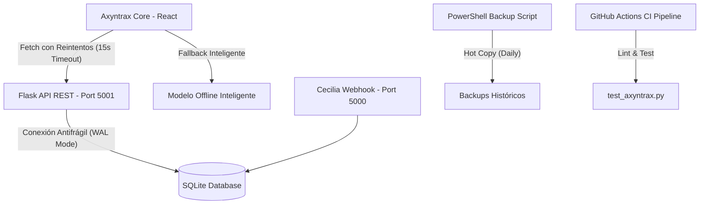

# 🛡️ MANUAL DE HARDENING Y RESILIENCIA — AXYNTRAX AUTOMATION SUITE

Este manual documenta de manera detallada la arquitectura antifrágil implementada en la suite de Axyntrax para garantizar alta disponibilidad, tolerancia a fallos y copias de seguridad consistentes en entornos de desarrollo local y de producción.

---

## 🏗️ 1. MAPA DE LA NUEVA ARQUITECTURA ROBUSTA



---

## 🛠️ 2. COMPONENTES Y BLINDAJES IMPLEMENTADOS

### 🗄️ A. Base de Datos Antifrágil (`db_master/_sqlite_backend.py`)
*   **Modo de Diario WAL (Write-Ahead Logging)**: Permite lecturas simultáneas mientras se ejecutan escrituras sin bloquear la base de datos.
*   **Reintentos Exponenciales Activos**: Implementación de hasta **5 intentos** con incremento exponencial del tiempo de espera ante bloqueos (`database is locked` / `busy`).

### 🐍 B. Robustez en API REST (`axia_api.py`)
*   **Manejo Seguro en `/api/dashboard/kpis`**: Si la base de datos sufre un bloqueo temporal mayor al timeout, el endpoint ya no arroja un error `500`; en su lugar, devuelve datos precalculados de contingencia para mantener la UI operativa.

### 💻 C. Reintentos y Fallback en Frontend (`AxiaCentralPage.jsx`)
*   **Reintentos Progresivos**: El cliente de chat de AXIA intentará realizar la consulta hasta **3 veces** antes de rendirse ante micro-cortes o congestiones.
*   **Fallback Silencioso**: Si la API no responde tras los 3 intentos, la interfaz activa el modelo fuera de línea inteligente (`getOfflineResponse`) manteniendo una experiencia de usuario fluida y sin ventanas de error intrusivas.

### 🚀 D. Lanzador Reubicable (`INICIAR_SISTEMA.bat`)
*   **Rutas Dinámicas**: Utiliza variables de entorno nativas de Windows (`%~dp0`) para permitir mover o reubicar la suite completa sin romper rutas de acceso a scripts de Python, base de datos o carpeta frontend.
*   **Logs Estructurados**: Almacenamiento organizado de registros de ejecución dentro del directorio `/logs` del proyecto.

---

## 💾 3. COPIAS DE SEGURIDAD AUTOMATIZADAS (`db_backup.ps1`)

El script de PowerShell [db_backup.ps1](file:///C:/Users/YARVIS/.gemini/antigravity/scratch/AXYNTRAX_AUTOMATION_Suite/db_backup.ps1) automatiza las copias de seguridad consistentes en caliente de SQLite con las siguientes características:
1.  **Formato de Nombre**: `axyntrax_YYYYMMDD_HHMMSS.db`.
2.  **Rotación de Respaldos**: Eliminación automática de copias con antigüedad mayor a **15 días** para proteger el disco.
3.  **Logs de Auditoría**: Historial completo registrado en `/logs/backup_history.log`.

---

## 🧪 4. PRUEBAS E INTEGRACIÓN CONTINUA (CI)

*   **Suite pytest** (`tests/test_axyntrax.py`): Contiene pruebas unitarias automatizadas para verificar conexiones robustas, consistencia de KPIs y el estado del endpoint de salud.
*   **Workflow GitHub Actions** (`.github/workflows/ci.yml`): Pipeline de integración que audita la sintaxis con `flake8`, levanta el servidor de fondo y valida el healthcheck antes de fusiones en ramas principales.

---

## 🔄 5. PLAN DE REVERSIÓN (ROLLBACK)

Si por alguna razón necesitas restaurar el sistema al estado inicial previo a las optimizaciones de robustez, sigue estos pasos:

1.  **Detén los procesos activos** cerrando las ventanas de la terminal CMD.
2.  **Restaura los archivos originales**:
    ```powershell
    copy .\INICIAR_SISTEMA_BAK.bat .\INICIAR_SISTEMA.bat /Y
    # Restaura tu base de datos desde la última copia de seguridad si es necesario
    copy .\backups\axyntrax_ULTIMA_COPIA.db .\data\axyntrax.db /Y
    ```
