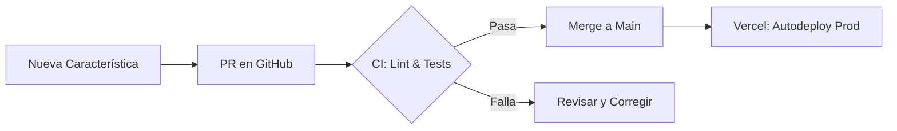

# 📖 GUÍA OPERATIVA Y RUNBOOK DE EMERGENCIA — AXYNTRAX

Este documento contiene toda la información necesaria para arrancar, desplegar, monitorear y revertir el ecosistema **AXYNTRAX Automation Suite** en caso de fallos. Es la fuente única de verdad para el mantenimiento del sistema.

---

## 🚀 1. Flujo de Despliegue Estándar

El ecosistema sigue un riguroso flujo de Integración y Despliegue Continuo (CI/CD) para evitar interrupciones de servicio en producción:



### Pasos para un cambio operativo:
1. Crear una rama local con el formato: `feature/<nombre_descriptivo>` o `fix/<nombre_descriptivo>`.
2. Ejecutar la suite de pruebas localmente: `pytest tests/test_axyntrax.py`.
3. Crear un PR hacia `main`. Al crearse el PR, **Vercel** generará una vista previa (Preview Deployment) para validar visualmente los cambios.
4. Una vez aprobado por el equipo, realizar el Merge a `main`. Vercel desplegará a producción de forma automática en < 5 minutos.

---

## 💻 2. Comandos Clave de Operación

### Arrancar el Ecosistema Localmente:
Ejecuta el orquestador central (JARVIS) que levantará la API unificada y el Webhook de Cecilia con reinicio automático ante caídas:
```powershell
python jarvis_orchestrator.py
```

### Arrancar los Servicios Manualmente ( CMD / Terminales separadas ):
* **API REST Unificada (Puerto 5001):**
  ```powershell
  python axia_api_unificada.py
  ```
* **Webhook Cecilia (Puerto 5000):**
  ```powershell
  python axia_webhook_v2.py
  ```

### Ejecutar Pruebas Automatizadas:
```powershell
pytest tests/test_axyntrax.py
```

### Consultar la Base de Datos SQLite:
```powershell
sqlite3 data/axyntrax.db "SELECT * FROM clientes LIMIT 5;"
```

---

## 🚨 3. Runbook de Emergencia y Recuperación (Rollback)

Si se detectan errores 5xx en producción o el bot de WhatsApp (Cecilia) deja de responder, siga estos pasos de mitigación inmediata:

### Paso 1: Monitorear el estado actual
Revise los últimos logs para identificar la causa raíz (e.g. error de conexión, límite de cuota excedido, base de datos bloqueada):
```powershell
Get-Content logs\orchestrator.log -Tail 50
Get-Content logs\backend_webhook.log -Tail 50
```

### Paso 2: Ejecutar Rollback en Vercel (< 5 minutos)
1. Ingrese a la consola de **Vercel** (`vercel.com/dashboard`).
2. Seleccione el proyecto `suite-diamante-dashboard`.
3. Vaya a la pestaña **Deployments**.
4. Busque el despliegue anterior estable (que funcionaba correctamente).
5. Haga clic en los tres puntos (`...`) y elija **Promote to Production**. Esto restaurará la versión anterior de forma inmediata sin reconstruir el código.

### Paso 3: Reversión Local (Base de Datos y Código)
Si los archivos de código sufrieron una corrupción local, restaure la versión desde el último tag de Git:
```powershell
git checkout archive-reorg-20260509
```
Para restaurar la base de datos a su copia de seguridad previa:
```powershell
Copy-Item backups\axyntrax_20260509_pre_reorg.db data\axyntrax.db -Force
```

---

## 🗃️ 4. Lista de Accesorios y Propietarios

* **Administrador del Sistema:** YARVIS (Contacto: `+51 991 740 590`)
* **Propietario del Dominio:** Miguel Montero (`axyntraxautomation@gmail.com`)
* **Bóveda de Secretos:** `.env` local y Environment Variables de Vercel.
